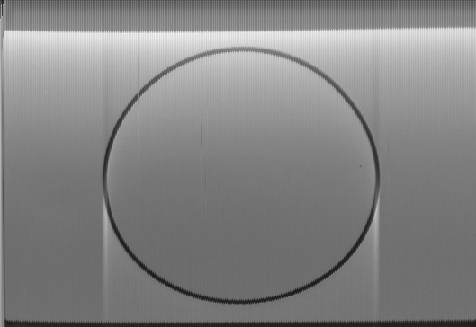

# voyager-1

Voyager 1 is a space probe that was launched by NASA on September 5, 1977. Part of the Voyager program to study the outer Solar System, Voyager 1 was launched 16 days after its twin, Voyager 2. --[Wikipedia](https://en.wikipedia.org/wiki/Voyager_1)


this repository contains the necessary code for R# scripting to decode the image data on the Voyager Golden Record.

> **Credits**: the test wav file data is comes from the project repository: [Voyager-Golden-Record-Decoder](https://github.com/mmcc1/Voyager-Golden-Record-Decoder).

# demo and library usage

Here is an example ``R#`` script for decode the first circle image in the goden record:

```R
# R# "E:\voyager-1\Rscript\first-circle.R" --debug --ignore-missing-startup-packages

imports "voyager1" from "voyager";
imports "wav" from "signalKit";

const goldenRecord as string = "J:\GoogleDrive\Voyager\384kHzStereo.wav";

# A demo R# script for image decode from the goden record wave data
# this very first circle image on the goden record is used for 
# parameter calibration of the image decoder
using wav as read.wav(file = file(goldenRecord), lazy = TRUE) {
    # view of the raw file data summary;
    print(wav);

    # parameters of the first circle image
    # and wav decoder arguments
    let first_circle = new image.chunk(channel = "Left", start = 6000208, length = 1928181);
    let decoder = new decode(windowSize = 3400, offset = 217);

    print(first_circle);
    print("data size of this image chunk:");
    print(wav :> chunk_size(chunk = first_circle));

    # run decoder and save the
    # result image file
    wav 
    :> decode(chunk = first_circle, decode = decoder)
    :> as.bitmap(white = 1.125)
    :> bitmap(file = `${dirname(!script$dir)}/docs/circle.png`)
    ;
}
```

Run the demo script with R# interpreter:


then the demo script should output an grayscale image that decoded from the wav data and looks like:



at last you could fine tuning the result image output in photoshop to make it more clarity.
